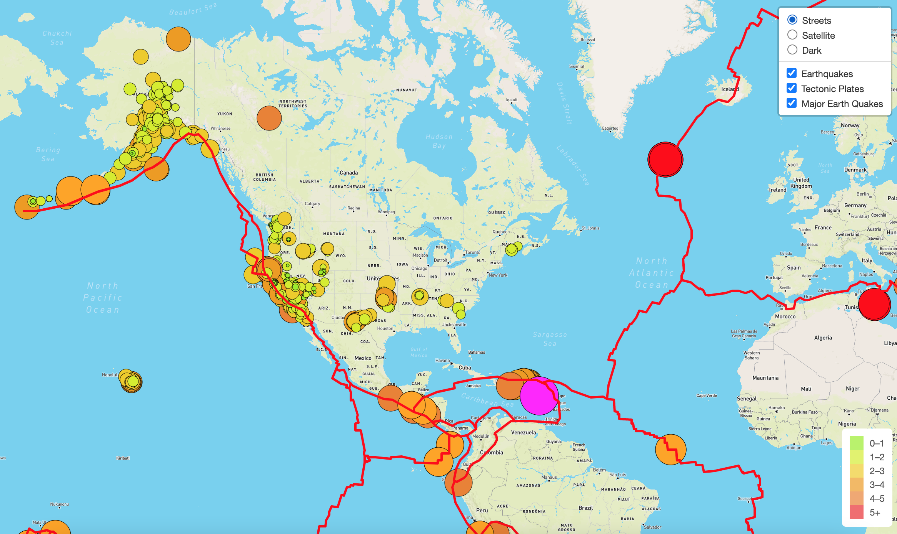
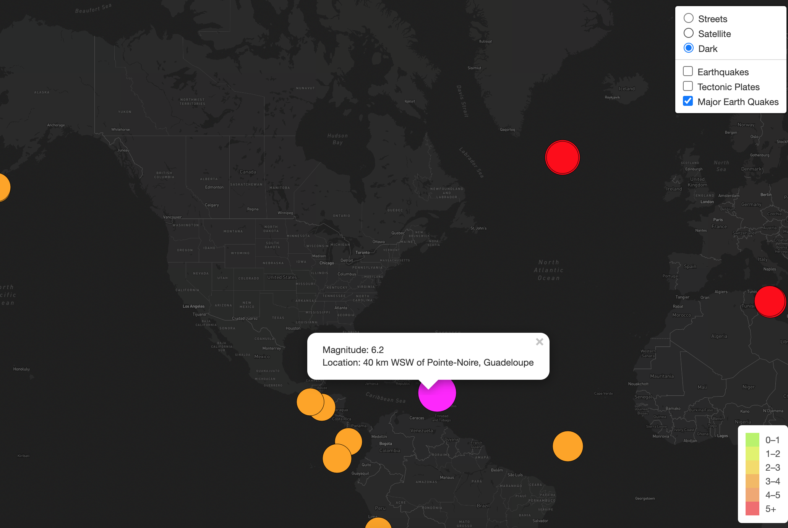

# Mapping_Earthquakes

# **Purpose**
Disaster Reporting Network, a company that provides data storytelling on disasters around the world, needed an interactive visualization on earthquakes that works on mobile and desktops. The initial website providing these visualizations was created using Leaflet.js Application Programming Interface, which built a geographical map with GeoJSON earthquake data from a URL. 

Each earthquake will be visually represented by a circle and color, where a higher magnitude will have a larger diameter and will be darker in color. In addition, each earthquake will have a popup marker that, when clicked, will show the magnitude of the earthquake and the location of the earthquake. The map had two different maps to toggle between and an earthquake overlay button. The earthquakes were displayed as a circle marker with the color and size related to the magnitude of each earthquake. 

The Disaster Reporting Network then required additional features to better visualize the earthquake GeoJSOn data. Below list the goals of the company's request.

## **Goal**
- Add earthquake data in relation to the tectonic plates’ location on the earth
- Add all the earthquakes with a magnitude greater than 4.5 on the map
- Put the above two goals on a third map

## **Resources**
- Resources: data.js
- Software: Visual Studio Code, JavaScript, CSS, HTML, DevTools, Leaflet.js Application Programming Interface (API), GeoJSON data

## **Results**
1.  Add Tectonic Plate Data 
Tectonic plate data was added to the JavaScript using d3.json(). The data was added using the geoJSON() layer. The tectonic plate LineString data was coded to red to stand out on the map. Lastly  the tectonic plate data was added to the overlay object with the original earthquake data.

2.  Add Major Earthquake Data
Major earthquake data was added to the map using d3.json(). Color was added and the radius of the circle markers was set to be based on the magnitude of each earthquake. A popup marker for each earthquake was added that displays the magnitude and location of the earthquake using the GeoJSON layer, geoJSON().

3.  Add an Additional Map
A third map in the Leaflet.js Dark view was added in the JavaScript file.

The overall map gives the user the ability to see the visualization in three different background choices: street, satellite and dark. It also gives the user the ability to understand the data but applying different layer groups to the map. The options are all earthquakes with popups, tectonic plates, and major earthquake data with popups. A legend is added to the bottom right as a quick visual reference which correlates to the magnitude of the earthquake. From these features the user can draw conclusions about earthquake data around the world.

See the images below as references:

### Overall Map With All Options Shown

### Satellite View With Tectonic Plates

### Dark View With Major Earthquakes and Popup 

